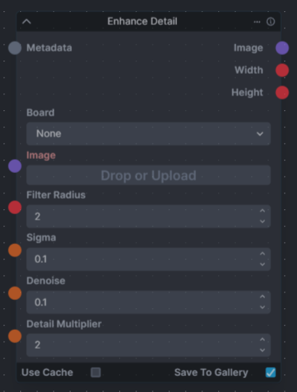
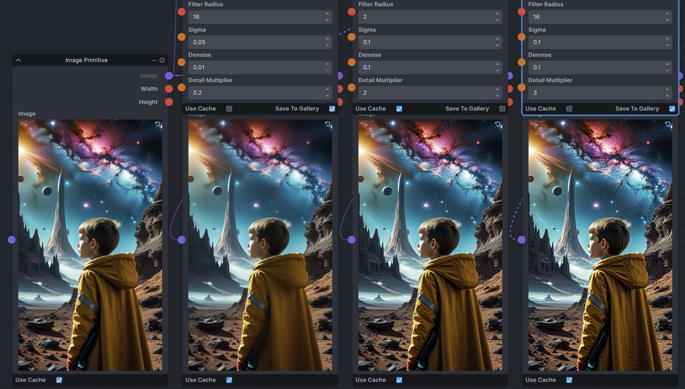

# `enhance-detail-node` for InvokeAI (v4.0+)
Discord Link :- [enhance-detail-node](https://discord.com/channels/1020123559063990373/1217543565698138183)

A single node that can enhance the detail in an image. Increase or decrease details in an image using a guided filter (as opposed to the typical Gaussian blur used by most sharpening filters.) Based on the `Enhance Detail` ComfyUI node from  https://github.com/spacepxl/ComfyUI-Image-Filters




`Filter Radius` int(1-100) adjusts how many pixels will be considered when filtering to find detail and denoise. A larger number when reducing detail will increase the smoothing effect. Also, a large denoise with a large radius will have a blurring effect.

`Sigma` Float(0.01-100) This is the EPS parameter of the Guided Filter routine. This has varied effects from not much to a lot depending on how much the other settings are generally the higher the other settings are the more this has an effect. I've not done enough testing to quantify it. 

`Denoise` Float(0-10) This is part of a bilateral filter to reduce noise in the image. High values will have the effect of blurring the image. A value of 0 will skip the Bilateral Filtering. 

`Detail Multiplier` Float(0-100) This has the most effect. Values 1 to 3 are normally the most presentable at increasing detail. Values under 1 will reduce the detail.


## Usage
### <ins>Install</ins><BR>
There are two options to install the nodes:

1. **Recommended**: Git clone into the `invokeai/nodes` directory. This allows updating via `git pull`.

    In the InvokeAI nodes folder, run:
    ```bash
    git clone https://github.com/skunkworxdark/enhance-detail-node.git
    ```

2. Manually download [enhance_detail.py](enhance_detail.py) & [__init__.py](__init__.py) then place them in a subfolder under `invokeai/nodes`. 

### <ins>Update</ins><BR>
Run a `git pull` from the `enhance-detail-node` folder.

Or run `update.bat`(windows) or `update.sh`(Linux).

For manual installs, download and replace the files.

### <ins>Remove</ins><BR>
Delete the `enhance-detail-node` folder. Or rename it to `_enhance-detail-node` so InvokeAI will ignore it.

## TODO
Example workflows and screenshots

## Examples


input:<BR>


Less Detail (Detail Multiplier 0.2)<BR>


Detail 2<BR>


Detail 3<BR>

